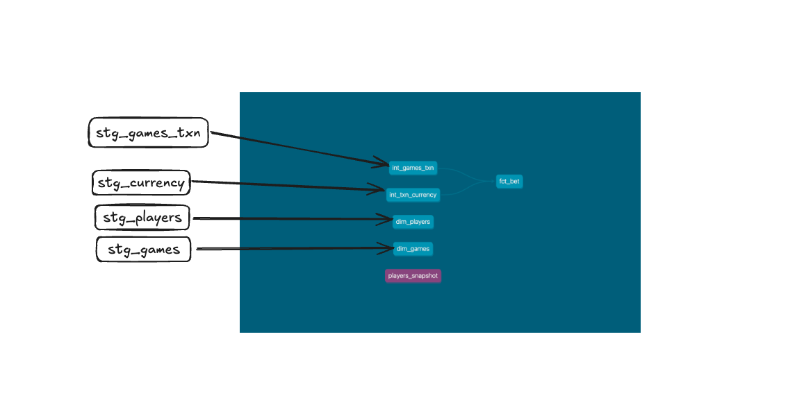
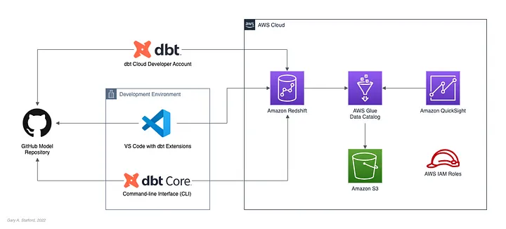

Welcome to Game Analytics dbt project!

### Components
Amazon Redshift as Data Warehouse
----------------
According to AWS, “Amazon Redshift uses SQL to analyze structured and semi-structured data across data warehouses, operational databases, and data lakes using AWS-designed hardware and machine learning to deliver the best price-performance at any scale.” AWS claims Amazon Redshift is the most widely used cloud data warehouse.

Amazon Redshift Spectrum as a staging Layer
----------------------
According to AWS, “Redshift Spectrum allows you to efficiently query and retrieve structured and semi-structured data from files in Amazon S3 without having to load the data into Amazon Redshift tables.” Redshift Spectrum tables define the data structure for the files in Amazon S3. The external tables exist in an external data catalog, which can be AWS Glue, the data catalog that comes with Amazon Athena, or an Apache Hive metastore.

dbt
----------------------
dbt (DataBuildTool) offers this mechanism by introducing a well-structured framework for data analysis, transformation and orchestration. It also applies general software engineering principles like integrating with git repositories, setting up DRYer code, adding functional test cases, and including external libraries. This mechanism allows developers to focus on preparing the SQL files per the business logic, and the rest is taken care of by dbt.

### Lineage
A holistic view of how data moves through the ELT pipeline, where it’s transformed and consumed. Overall, data lineage is a fundamental concept to understand in the practice of analytics engineering and modern data work.

At a high level, a data lineage system typically provides data teams and consumers with one or both of the following resources:

A visual graph (DAG) of sequential workflows at the data set or column level
A data catalog of data asset origins, owners, definitions, and policies




### Solution overview
The workflow will be deployed in AWS leveraging the below flow.

In the following code repo, we will explore the use of dbt (data build tool), developed by dbt Labs, to transform data in an AWS-based data lakehouse, built with Amazon Redshift (provisioned or Serverless), Amazon Redshift Spectrum, AWS Glue Data Catalog, and Amazon S3.




### Prerequisites
Prerequisites for this post’s demonstration include the following:

1-Amazon S3 bucket to store raw data;
2-Amazon Redshift provisioned cluster or Amazon Redshift Serverless;
3-AWS IAM Role with permissions to Amazon Redshift, Amazon S3, and AWS Glue;
4-dbt CLI (dbt Core) and dbt Amazon Redshift adapter installed locally;
5-Microsoft Visual Studio Code (VS Code) with dbt Power User extensions installed;
6- The code demonstration uses  VS Code, and the dbt CLI interchangeably with the project’s GitHub repository as a source. 


### How to run

Try running the following commands:
````
dbt run
dbt test
````
