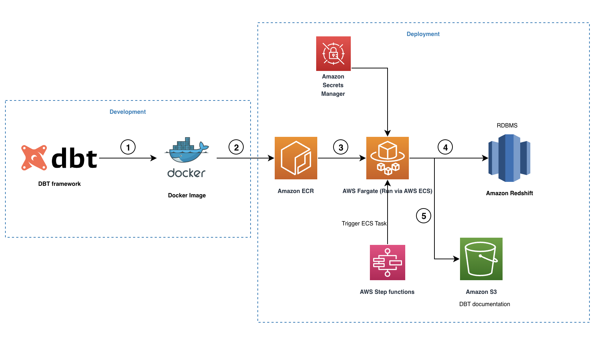

Welcome to Game Analytics dbt project!

### Components
Amazon Redshift as Data Warehouse
----------------
According to AWS, “Amazon Redshift uses SQL to analyze structured and semi-structured data across data warehouses, operational databases, and data lakes using AWS-designed hardware and machine learning to deliver the best price-performance at any scale.” AWS claims Amazon Redshift is the most widely used cloud data warehouse.

Amazon Redshift Spectrum as a staging Layer
----------------------
According to AWS, “Redshift Spectrum allows you to efficiently query and retrieve structured and semi-structured data from files in Amazon S3 without having to load the data into Amazon Redshift tables.” Redshift Spectrum tables define the data structure for the files in Amazon S3. The external tables exist in an external data catalog, which can be AWS Glue, the data catalog that comes with Amazon Athena, or an Apache Hive metastore.

dbt
----------------------
dbt (DataBuildTool) offers this mechanism by introducing a well-structured framework for data analysis, transformation and orchestration. It also applies general software engineering principles like integrating with git repositories, setting up DRYer code, adding functional test cases, and including external libraries. This mechanism allows developers to focus on preparing the SQL files per the business logic, and the rest is taken care of by dbt.

### Lineage
A holistic view of how data moves through the ELT pipeline, where it’s transformed and consumed. Overall, data lineage is a fundamental concept to understand in the practice of analytics engineering and modern data work.

At a high level, a data lineage system typically provides data teams and consumers with one or both of the following resources:

A visual graph (DAG) of sequential workflows at the data set or column level
A data catalog of data asset origins, owners, definitions, and policies

### Solution overview
The workflow will be deployed in AWS leveraging the below flow.

- The open source dbt-redshift connector is used to create our dbt project including all the necessary models, snapshots, tests, macros and profiles.
- A Docker image is created and pushed to the ECR repository.
- The Docker image is run by Fargate as an ECS task triggered via AWS Step Functions. All the Amazon Redshift credentials are stored in Secrets Manager, which is then used by the ECS task to connect with Amazon Redshift.
- During the run, dbt converts all the models, snapshots, tests and macros to Amazon Redshift compliant SQL statements and it orchestrates the run based on the internal data lineage graph maintained. These SQL commands are run directly on the Redshift cluster and therefore the workload is pushed to Amazon Redshift directly.
- When the run is complete, dbt will create a set of HTML and JSON files to host the dbt documentation, which describes the data catalog, compiled SQL statements, data lineage graph, and more.

### Resources:

